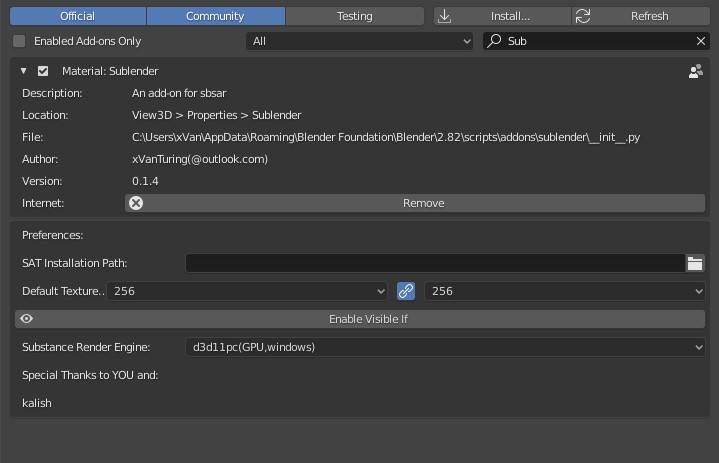

# Preference

### SAT Installation Path
It' mainly for Linux User, without setting it in Linux, sublender will not be able
to render texture

### Default Texture Size
Default render size for texture

### Enable Visible If
Enable support of `visibleIf`, with it enabled, sublender will hide input/group based on 
`visibleIf` of substance input, otherwise, will group/input will be displayed
### Substance Render Engine:
Render engine for rendering textures. \
on windows you will have:
* `SSE2(CPU)`
* `d3d11pc(GPU,2020)`
* `d3d10pc(GPU,2019)`
on linux you will have:
* `SSE2(CPU)`
* `ogl3(GPU,2020)`

You can enter a custom engine name if you choose `Custom`