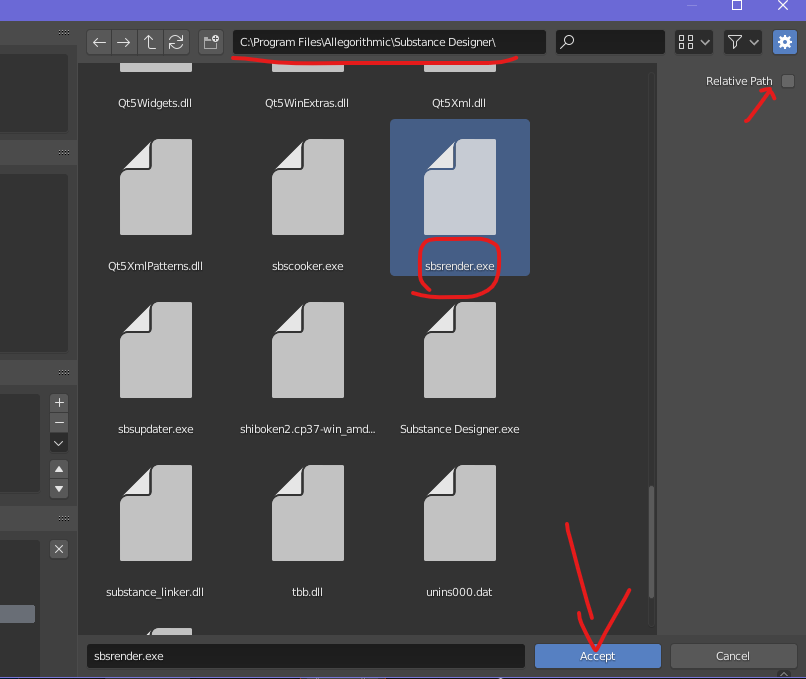

# Installation
# Version v1.0.4 sbsar-lite
## Requirement 
* Substance Designer (activation is now required)
* Internet
* Some Patient
## Depedencies
1. Go to your blender installation folder,then `2.83\python\bin`, and copy the path, eg.
    > `C:\Program Files\Blender Foundation\Blender 2.83\2.83\python\bin`
2. Right click on Windows Start, and click Powershell, you will need the one 
with administrator privileges.
3. Type following commands
    ``` ps
    cd "C:\Program Files\Blender Foundation\Blender 2.83\2.83\python\bin"
    .\python.exe -m pip install py7zr
    ```
    > please replace the path with your own
4. Now install pysbs-sbsarlite.zip like any other add-ons

5. Click the folder button in Sbsrender Path to select the `sbsrender.exe` in your Substance Designer installation folder, please turn off the Relative Path option.

6. Please Enjoy!

# Version v1.0.3
## Substance Automation Toolkit
1. Download SAT and Install 
2. Copy file path of `pysbs_version.zip` under SAT Folder\Python API
> `C:\Program Files\Allegorithmic\Substance Automation Toolkit\Python API\Pysbs-2020.1.1.zip`
3. Go to your blender installation folder
> `C:\Program Files\Blender Foundation\Blender 2.82\2.82\python\bin`
4. open a cmd or powershell and execute(**best with admin permission for blender 2.83**)
> `.\python.exe -m pip install C:\Program Files\Allegorithmic\Substance Automation Toolkit\Python API\Pysbs-2020.1.1.zip`(replace the filepath with your own)

## Sublender.zip
1. Open Blender -> Edit -> Preference -> Add-On -> Install -> Select sublender.zip and install
2. For Linux user, you will need to fill the input named `SAT Installation Path`